# 🌱 GreenBucks - Sustainable Finance Platform

**Made with 💚 @ PennApps XXVI**

### 👥 Team Members
- **Apoorv Thite**
- **Aarya Soni** 
- **Kartavya Suhagiya** 
- **Nikhil Saini**

A revolutionary fintech application that rewards sustainable spending through AI-powered eco-scoring, real bank integration, and personalized environmental insights.


## 🏆 Overview

GreenBucks transforms how people think about their environmental impact by connecting real banking data to eco-friendly rewards and actionable insights. Using advanced AI and machine learning, we analyze spending patterns to provide personalized recommendations for more sustainable financial decisions.

### 🎯 Key Features

- **🏦 Real Bank Integration**: Connect via Plaid to analyze actual spending data
- **🌍 CO2-Based Eco-Scoring**: Realistic environmental impact calculations for every transaction
- **💰 Smart Cashback System**: Earn rewards based on eco-friendliness (up to 5% for Eco++ purchases)
- **🤖 AI Assistant (Koshi)**: Personalized eco-tips powered by Google Gemini AI
- **📱 Receipt OCR**: Upload receipts for item-level environmental analysis
- **📊 Comprehensive Analytics**: Real-time dashboards and spending insights
- **🏅 Gamification**: Leaderboards and eco-challenges for behavior change

## 🚀 Live Demo

**Demo Credentials:**
- Email: `apoorv@example.com`
- Password: `password123`

## 🛠️ Tech Stack

### Frontend
- **React 18** with Vite for fast development
- **Tailwind CSS** for modern, responsive design
- **React Router** for seamless navigation
- **Zustand** for state management
- **Lucide React** for beautiful icons

### Backend
- **FastAPI** (Python) for high-performance API
- **PostgreSQL** for robust data storage
- **SQLAlchemy** for database ORM
- **Plaid API** for secure bank connectivity
- **Google Vision API** for OCR processing
- **Tesseract OCR** as failsafe for image recognition
- **Climatiq API** for accurate carbon impact calculations

### AI & Machine Learning
- **Google Gemini AI** for intelligent conversational responses
- **Cerebras API** for accurate receipt item parsing
- **Custom CO2 Calculation Engine** powered by Climatiq API
- **Receipt Analysis Pipeline** for item-level eco-scoring

### Infrastructure
- **Alembic** for database migrations
- **Pydantic** for data validation
- **CORS** enabled for secure cross-origin requests

## 📁 Project Structure

```
GreenBucks/
├── greenfrontend/          # React frontend application
│   ├── src/
│   │   ├── components/     # Reusable UI components
│   │   │   ├── UI/        # Base UI components (Button, Card, etc.)
│   │   │   ├── Layout/    # Layout components (Header, Footer)
│   │   │   ├── Decor/     # Visual components (Backgrounds, Hero)
│   │   │   └── Koshi/     # AI chatbot components
│   │   ├── routes/        # Page components
│   │   ├── lib/           # Utilities and API clients
│   │   └── assets/        # Static assets
├── greenbackend/          # FastAPI backend application
│   ├── backend/
│   │   ├── app/
│   │   │   ├── api/       # API route handlers
│   │   │   ├── models/    # Database models
│   │   │   ├── services/  # Business logic
│   │   │   └── db/        # Database configuration
│   └── alembic/           # Database migrations
└── README.md
```

## 🎯 User Journey: From Login to Eco-Rewards

```mermaid
graph TD
    A[🚀 User visits GreenBucks] --> B[🔐 Login/Register]
    B --> C[📱 Connect Bank via Plaid]
    C --> D[⚡ Auto-sync 100+ Transactions]
    D --> E[🤖 AI Eco-Scoring with Climatiq]
    E --> F[📊 View Dashboard]
    
    F --> G[💚 Check Eco-Wallet]
    F --> H[📈 See Green Score: Average Rating]
    F --> I[⭐ View Eco Points & Ranking]
    
    G --> J[🧾 Upload Receipt for Mixed Purchases]
    J --> K[👁️ Google Vision OCR Processing]
    K --> L[🧠 Cerebras AI Item Parsing]
    L --> M[🌍 Climatiq CO2 Analysis]
    M --> N[💰 Calculate Item-level Cashback]
    N --> O[✅ Attach Receipt to Transaction]
    
    H --> P[🤖 Chat with Koshi AI Assistant]
    P --> Q[💡 Get Personalized Eco-Tips]
    Q --> R[🎯 Receive Behavior Nudges]
    R --> S[📚 Learn Environmental Impact]
    
    I --> T[🏆 Check Leaderboard Position]
    T --> U[👥 Compare with Friends]
    U --> V[🎮 Join Eco-Challenges]
    V --> W[🏅 Earn Achievement Badges]
    
    O --> X[🔄 Real-time Score Updates]
    S --> X
    W --> X
    X --> Y[📊 Track Monthly Progress]
    Y --> Z[🌱 Build Sustainable Habits]
    
    style A fill:#10b981
    style B fill:#3b82f6
    style C fill:#8b5cf6
    style D fill:#f59e0b
    style E fill:#ef4444
    style F fill:#06b6d4
    style Z fill:#10b981
```



### 🔄 **Complete User Flow:**

1. **🚀 Onboarding** → Login with demo credentials (`apoorv@example.com` / `password123`)
2. **🏦 Bank Connection** → Secure Plaid integration syncs transaction history
3. **🤖 AI Analysis** → Climatiq API calculates CO2 impact, assigns eco-scores (1-10)
4. **📊 Dashboard View** → See Eco-Wallet ($23,379+), Green Score, and Eco Points
5. **🧾 Receipt Upload** → OCR + AI parsing for detailed item-level analysis
6. **💬 AI Assistant** → Chat with Koshi for personalized sustainability tips
7. **🏆 Gamification** → Compete on leaderboards, earn badges, join challenges
8. **🌱 Behavior Change** → Track progress and build sustainable spending habits

## 🔧 Quick Setup

```bash
# Backend
cd greenbackend && pip install -r requirements.txt
uvicorn backend.app.main:app --reload --port 8787

# Frontend  
cd greenfrontend && npm install && npm run dev
```

**Environment Variables:** Plaid, Google Vision/Gemini, Cerebras, Climatiq API keys required.

## 🌟 Key Features Deep Dive

### 🏦 Bank Integration
- **Plaid Sandbox Integration**: Secure connection to 4,160+ realistic transactions
- **Real-time Sync**: Automatic transaction updates and categorization
- **Multi-bank Support**: Connect multiple accounts seamlessly
- **Privacy First**: Bank data encrypted and processed securely

### 🌍 Environmental Impact Scoring

Our proprietary eco-scoring algorithm analyzes transactions using:

1. **Category-Based Scoring**: 
   - Public Transit: 9-10 (Eco++)
   - Groceries/Coffee: 7-8 (Eco+)
   - Restaurants: 5-6 (Neutral)
   - Gas/Ride Share: 3-4 (Less-Eco)
   - Airlines: 1-2 (Non-Eco)

2. **Climatiq API Integration**: Precise CO2 calculations using real environmental data
3. **Receipt Analysis**: Item-level scoring for mixed retailers
4. **Dynamic Adjustments**: Scores evolve with spending patterns

### 🤖 Meet Koshi: Your Eco-Friendly AI Companion

**Why "Koshi"?** In Sanskrit, "Koshi" (कोशी) means "treasury" or "treasure chest" - perfectly embodying our AI assistant who helps you discover the hidden treasures of sustainable living while building your eco-wallet. Just as a treasury holds valuable resources, Koshi holds the wisdom to transform your spending habits into environmental rewards.

**Koshi's Capabilities:**
- **Personalized Analysis**: Examines your unique spending patterns using real transaction data
- **Smart Recommendations**: Suggests eco-friendly alternatives based on your lifestyle
- **Behavioral Coaching**: Provides gentle nudges toward more sustainable choices
- **Environmental Education**: Explains the CO2 impact of your purchases in simple terms
- **Progress Celebration**: Acknowledges your eco-improvements and milestones
- **Interactive Chat**: Powered by Google Gemini AI for natural, helpful conversations
- **Voice Integration**: Supports speech-to-text and text-to-speech for accessibility

### 📱 Receipt OCR System

Advanced receipt processing pipeline with multiple AI layers:
1. **Google Vision API**: Primary OCR for text extraction from receipt images
2. **Tesseract OCR**: Failsafe backup for image recognition when Vision API fails
3. **Cerebras API**: Accurate parsing of extracted text into individual items and prices
4. **Climatiq CO2 Analysis**: Precise environmental impact calculations for each item
5. **Eco-Scoring**: Assigns environmental scores based on real carbon footprint data
6. **Transaction Linking**: Associates receipts with bank transactions

### 💰 Cashback Rewards

Dynamic reward system based on eco-scores:
- **Base Rate**: 1% on all purchases
- **Eco Bonus**: Up to 4% additional for sustainable spending
- **Total Potential**: Up to 5% cashback on Eco++ purchases
- **Real Rewards**: $23,379+ in total available cashback

## 📊 Analytics & Insights

### Dashboard Metrics

#### **💚 Eco-Wallet**
- **Total Cashback**: $23,379+ available across all users
- **Personal Earnings**: Real-time tracking of individual cashback
- **Reward Rates**: Dynamic 1-5% based on eco-score performance
- **Monthly Growth**: Track sustainable spending improvements

#### **📊 Green Score**
- **Average Rating**: Environmental impact across all transactions (1-10 scale)
- **Category Breakdown**: Performance by spending category
- **Trend Analysis**: Month-over-month eco-score improvements
- **CO2 Impact**: Real carbon footprint data via Climatiq API

#### **⭐ Eco Points**
- **Base Points**: Direct correlation with eco-scores
- **Bonus Multipliers**: Extra points for Eco++ purchases
- **Achievement Rewards**: Special bonuses for milestones
- **Leaderboard Ranking**: Compare with community members

### Transaction Analysis
- **Category Breakdown**: Detailed spending by environmental impact
- **Merchant Recognition**: 40+ specific merchants with custom scoring
- **Trend Tracking**: Month-over-month improvement in eco-scores
- **Goal Setting**: Personalized targets for sustainable spending

## 🎮 Gamification Features

### 🏆 Leaderboard & Achievements
```
Top Eco-Warriors:

```
**Achievement Badges:** Eco++ Streak, Carbon Saver, Transit Hero, Green Shopper (Future Scope)

## 🔒 Security & Privacy

- **Bank-Level Security**: Plaid's industry-standard encryption
- **JWT Authentication**: Secure user session management
- **Data Minimization**: Only necessary financial data processed
- **Transparent Processing**: Clear explanation of data usage
- **User Control**: Easy account deletion and data export

## 🚀 Performance Optimizations

### Frontend
- **Lazy Loading**: Components loaded on demand
- **Code Splitting**: Optimized bundle sizes
- **Caching**: Smart data caching with cache busting
- **Responsive Design**: Mobile-first approach

### Backend
- **Database Indexing**: Optimized query performance
- **Connection Pooling**: Efficient database connections
- **Async Processing**: Non-blocking I/O operations
- **Error Handling**: Comprehensive error management

## 📈 Impact & Results

### Environmental Benefits
- **CO2 Awareness**: Users understand environmental cost of purchases
- **Behavior Change**: Incentivized shift to sustainable options
- **Education**: Learning about eco-friendly alternatives
- **Community**: Shared commitment to environmental responsibility

### Technical Achievements
- **4,160+ Transactions**: Successfully processed and scored
- **100% Uptime**: Robust error handling and recovery
- **Sub-second Response**: Fast AI-powered insights
- **Scalable Architecture**: Ready for production deployment

## 🚀 Future Scope & Roadmap

### **🏦 Enhanced Banking Integration**
- **Multi-Bank Support**: Connect multiple accounts from different institutions
- **International Banks**: Expand beyond US to global banking systems
- **Credit Card Integration**: Include credit card transactions and rewards
- **Investment Tracking**: Monitor ESG investments and sustainable portfolios

### **👥 Community & Social Features**

#### **🏠 Roommate & Friend Challenges**
- **Group Eco-Challenges**: Monthly sustainability competitions
- **Shared Goals**: Collective carbon reduction targets
- **Progress Sharing**: Real-time updates on group performance
- **Reward Splitting**: Share cashback earnings for group achievements

#### **🏆 Advanced Leaderboard System**
- **Multiple Categories**: Transit heroes, green shoppers, carbon savers
- **Seasonal Competitions**: Quarterly eco-challenges with prizes
- **Local Rankings**: Compare with users in your city/region
- **Achievement Badges**: Unlock special recognition for milestones

#### **💰 Bill Splitting & Eco-Score Sharing**
- **Splitwise Integration**: Seamless bill splitting with eco-score tracking
- **Shared Receipts**: Upload group purchases and distribute eco-points
- **Fair Share Calculation**: Split environmental impact among participants
- **Group Cashback**: Collective rewards for sustainable group spending

### **🎁 Rewards & Incentives**

#### **🛍️ Shopping Rewards**
- **Partner Discounts**: Exclusive deals with eco-friendly brands
- **Cashback Redemption**: Convert eco-points to real shopping credits
- **Sustainable Products**: Curated marketplace for green alternatives
- **Local Business Partnerships**: Support eco-friendly local merchants

#### **🏅 Achievement System**
- **Milestone Rewards**: Physical prizes for top performers
- **Certification Programs**: Eco-warrior certificates and credentials
- **Brand Partnerships**: Exclusive access to sustainable product launches
- **Carbon Offset Credits**: Purchase real carbon offsets with eco-points

### **🔬 Advanced Analytics**

#### **📈 Predictive Insights**
- **Spending Forecasts**: Predict future eco-score trends
- **Behavior Recommendations**: AI-powered suggestions for improvement
- **Impact Projections**: Visualize long-term environmental benefits
- **Goal Optimization**: Personalized targets based on lifestyle patterns

#### **🌍 Environmental Impact Tracking**
- **Carbon Footprint Dashboard**: Detailed CO2 emissions by category
- **Water Usage Calculations**: Track water impact of purchases
- **Waste Generation Metrics**: Monitor packaging and waste production
- **Biodiversity Impact**: Assess effects on ecosystems and wildlife

### **🤖 AI & Machine Learning Enhancements**

#### **🧠 Smarter Recommendations**
- **Contextual Suggestions**: Location and time-based eco-tips
- **Habit Formation**: AI-guided sustainable behavior development
- **Personalized Coaching**: Custom eco-improvement programs
- **Predictive Nudges**: Proactive suggestions before purchases

#### **📱 Advanced Receipt Processing**
- **Real-time OCR**: Instant receipt processing via mobile camera
- **Ingredient Analysis**: Detailed sustainability scoring for food items
- **Brand Recognition**: Automatic identification of eco-friendly brands
- **Alternative Suggestions**: Recommend greener product alternatives

### **🌐 Platform Expansion**

#### **📱 Mobile Applications**
- **Native iOS/Android Apps**: Full-featured mobile experience
- **Offline Functionality**: Core features available without internet
- **Push Notifications**: Real-time eco-tips and achievement alerts
- **Widget Integration**: Quick eco-score checks from home screen

#### **🔗 Third-Party Integrations**
- **Mint/YNAB Sync**: Import data from existing financial tools
- **Google Pay/Apple Pay**: Direct integration with mobile wallets
- **Amazon/Shopping APIs**: Analyze online purchase sustainability
- **Fitness Apps**: Connect eco-actions with health and wellness goals

### **💼 Business & Enterprise Features**

#### **🏢 Corporate Sustainability**
- **Company Dashboards**: Track employee eco-spending patterns
- **Team Challenges**: Department-wide sustainability competitions
- **CSR Integration**: Connect with corporate social responsibility programs
- **Expense Report Integration**: Eco-scoring for business expenses

#### **🎓 Educational Institutions**
- **Campus Challenges**: University-wide sustainability competitions
- **Student Discounts**: Special rates for educational institutions
- **Research Partnerships**: Collaborate on environmental impact studies
- **Curriculum Integration**: Educational content for sustainability courses

## 🤝 Contributing

We welcome contributions! Please see our [Contributing Guidelines](CONTRIBUTING.md) for details.

### Development Workflow
1. Fork the repository
2. Create a feature branch (`git checkout -b feature/amazing-feature`)
3. Commit changes (`git commit -m 'Add amazing feature'`)
4. Push to branch (`git push origin feature/amazing-feature`)
5. Open a Pull Request

## 📝 API Documentation

### Authentication Endpoints
```
POST /auth/login          # User login
POST /auth/register       # User registration
POST /auth/verify-token   # Token verification
```

### Transaction Endpoints
```
GET  /transactions/       # List user transactions
POST /transactions/sync   # Sync Plaid transactions
GET  /transactions/{id}   # Get specific transaction
```

### Receipt Endpoints
```
POST /receipts/upload     # Upload and process receipt
GET  /receipts/{id}/items # Get receipt items
POST /receipts/attach     # Attach receipt to transaction
```

### Plaid Endpoints
```
POST /plaid/link-token    # Create Plaid link token
POST /plaid/exchange      # Exchange public token for access token
POST /plaid/sync          # Sync transactions from Plaid
```

## 📞 Contact & Team

**Built by passionate developers at PennApps XXVI**


## 🙏 Acknowledgments

- **PennApps XXVI** for the incredible hackathon experience
- **Plaid** for secure banking API access
- **Google Cloud** for Gemini AI and Vision API services
- **Cerebras** for high-performance receipt parsing
- **Climatiq** for accurate carbon footprint calculations
- **Tesseract OCR** for reliable text recognition
- **Open Source Community** for amazing tools and libraries

---

**Made with 💚 @ PennApps XXVI**

*Transforming finance for a sustainable future, one transaction at a time.* 🌍✨